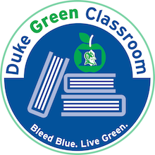

### Teaching team:

|------------+------------------------+-----------------------------------------|
|Professor   | [Dr. Çetinkaya-Rundel](http://stat.duke.edu/~mc301) | [mine@stat.duke.edu](mailto:mine@stat.duke.edu)
|:-----------|:-----------------------|:----------------------------------------|
|**TAs**     | David Clancy (head TA) | [djc37@duke.edu](mailto:djc37@duke.edu) |
|            | Lindsay Berry          | [lrb38@stat.duke.edu](mailto:lrb38@stat.duke.edu) |
|            | Patrick Cardel         | [patrick.cardel@duke.edu](mailto:patrick.cardel@duke.edu) |
|            | Anthony Hung           | [anthony.hung@duke.edu](mailto:anthony.hung@duke.edu) |
|            | John Pura              | [john.pura@duke.edu](mailto:john.pura@duke.edu) |
|            | Sarah Zimmerman        | [sarah.zimmermann@duke.edu](mailto:sarah.zimmermann@duke.edu) |
|------------+------------------------+-----------------------------------------|

* * *

### Required materials:

* Textbook: [OpenIntro Statistics](http://openintro.org/os) - Diez, Barr, Çetinkaya-Rundel \\
   CreateSpace, 3rd Edition, 2015 (ISBN: 978-1943450039) \\
The textbook is freely [available online](http://openintro.org/os). You're welcomed to read on screen or print it out. If you prefer a paperback version you can buy it at the cost of printing (around $10) [on Amazon](http://openintro.org/os). The textbook store will not carry copies of this text.

* Clicker: [i>clicker2](http://www.amazon.com/I-Clicker-2-I-Clicker/dp/1429280476) (ISBN: 1429280476) \\
If you would like to purchase a used clicker from a former student, see the list of students selling their clickers [at this Google Doc](https://docs.google.com/spreadsheet/ccc?key=0AkY2lFgS9uiDdE1fMkZUZnp6alJDSG9tYlIwTFJWdnc#gid=0). You can contact them directly, or leave your name on the list under "Wants to buy clicker". The clickers will also be available at the Duke textbook store, or you can get them for slightly cheaper [on Amazon](http://www.amazon.com/I-Clicker-2-I-Clicker/dp/1429280476). Note that this is i>clicker2, and not i>clicker+.

* Calculator (optional): You will be allowed to use a calculator in this class. There is no restrictions on the type of calculator. A simple calculator that can take square roots should be sufficient.

* * *

### Class meetings:
* Lectures: Mondays and Wednesdays, 1:25pm - 2:40pm, LSRC ROOM B 101
* Labs: Thursdays
    * 8:30am - 9:45am - Link Classroom 3 - TA: David Clancy
    * 10:05am - 11:20am - Link Classroom 3 - TA: David Clancy
    * 11:45am - 1:00pm - Link Classroom 4 - TA: Lindsay Berry
    * 1:25pm - 2:40pm - Link Classroom 3 - TA: Lindsay Berry
    * 3:05pm - 4:20pm - Link Classroom 4 - TA: John Pura
    * 4:40pm - 5:55pm - Link Classroom 4 - TA: John Pura

* * *

### Exams:

* Midterm 1: Feb 24, Wed, in class
* Midterm 2: Mar 30, Wed, in class
* Final: May 5, Thu - 7-10pm

* * *

### Office Hours:
* Professor Cetinkaya-Rundel:
    * Discussion section: Tuesdays, 4 - 5:30pm, Soc Sci 139
    * Office hours: Thursdays, 10:30am - 12pm, Old Chem 213 (my office)
* Teaching Assistants:

|---------------------+----------------------------------+---------------|
| TA                  | Day / time                       | Location      |
|:--------------------|:---------------------------------|:--------------|
|David Clancy         | Sun 7:30pm - 9:30pm              | Old Chem 025  |
|Sarah Zimmerman      | Mon 9:30am - 11:30am             | Old Chem 211A |
|Drew Jordan          | Mon 4:30pm - 5:30pm + 7pm - 8pm  | Old Chem 211A |
|Andrew Wong          | Mon 7:30pm - 9:30pm              | Old Chem 025  |
|Anne Driscoll        | Tue 9:30am - 11:30am             | Old Chem 211A |
|Katherine Ahn        | Tue 11am - 1pm                   | Old Chem 211A |
|John Pura            | Tue 1pm - 2pm + Th 6pm - 7pm     | Old Chem 211A |
|Andy Cooper          | Tue 2pm - 4pm                    | Old Chem 211A |
|Anthony Hung         | Tue 6pm - 8pm                    | Old Chem 025  |
|Patrick Cardel       | Wed 6:30pm - 8:30pm              | Old Chem 025  |
|Lindsay Berry        | Thu 3pm - 5pm                    | Old Chem 211A |

* * *

### Holidays:

* Jan 18, Mon - Martin Luther King, Jr. Day
* Mar 12, Sat - Mar 20, Sun - Spring Break

* * *

### Green Classroom

{:.right}

This course has achieved Duke’s Green Classroom Certification. The certification indicates that the faculty member teaching this course has taken significant steps to green the delivery of this course. Your faculty member has completed a checklist indicating their common practices in areas of this course that have an environmental impact, such as paper and energy consumption. Some common practices implemented by faculty to reduce the environmental impact of their course include allowing electronic submission of assignments, providing online readings and turning off lights and electronics in the classroom when they are not in use. The eco-friendly aspects of course delivery may vary by faculty, by course and throughout the semester. Learn more at [http://sustainability.duke.edu/action/certifications/classroom/index.php](http://sustainability.duke.edu/action/certifications/classroom/index.php).
